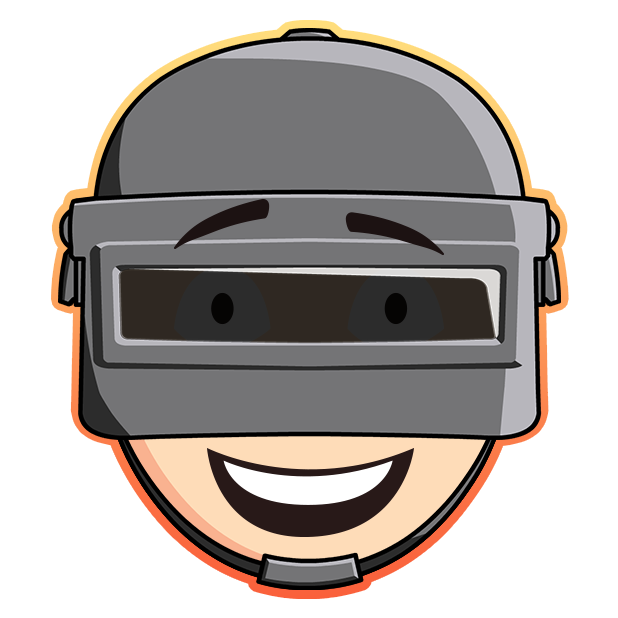

<p align="center">
<a href="https://reactjs.org">

</a>
</p>

<h2 align="center" style="border-bottom: none !important; margin-bottom: 5px !important;"><a href="https://pubgheatmap.net">An analytic tool for Player Unknown's Battle Ground - PUBG</a></h2>
<p align="center">
  <a target="_blank" rel="noopener noreferrer" href="https://github.com/mediusoft/PUBG-heatmap-frontend/blob/dev/LICENSE">
    
  </a>
  <a target="_blank" rel="noopener noreferrer" href="https://camo.githubusercontent.com/c83b8df34339bd302b7fd3fbb631f99ba25f87f8/68747470733a2f2f696d672e736869656c64732e696f2f62616467652f636f64655f7374796c652d70726574746965722d6666363962342e737667"></a>
  <a href="#" rel="nofollow"></a>
  
_Found it useful? Want more updates?_

[**Show your support by giving a :star:**](https://github.com/mediusoft/PUBG-heatmap-frontend/stargazers)

<a href="https://www.buymeacoffee.com/mhoz0yJ">
  
</a>
<a href="https://www.patreon.com/orkhan_rzazade">
  
</a>

</p>

<p align="center">
This app provides the front end which includes the heatmap and rendering of the 2D replay on canvas with React. See also <a href="https://github.com/mediusoft/PUBG-heatmap-backend">pubgheatmap/backend</a>.
</p>

<br />

> ✨ **Note:** This library is based on [pubgsh/client](https://github.com/pubgsh/client) with more features and cooler designs. I’m happy to consider suggestions, pull requests and bug reports.

<br />

### Screenshot

 

### About

- This project belongs to Mediusoft.
- We use:
  - Library - `React.js`,
  - Query language - `GraphQL`
  - React UI framework - `Material-UI`,
  - Styling - `JSS`,
  - IDE - `VS Code`,
  - Code analysis tool - `Eslint`
- 🤝 **Bingo!** If you are familiar with these tools then you're ready to continue further developing this project.
  <br />

### Configuration

1. Create `.env.local` [dotenv](https://github.com/motdotla/dotenv) file in the root of the project and provide the following values:

- `REACT_APP_API` (Where you have the companion)

### Quick Start

- Install dependencies by running `yarn` or `npm install`.
- Run `yarn start` or `npm run start` to start the local development server.
- 😎 **That's it!** You're ready to start improving the project.

<br />

### Project Structure

- This project is bootstrapped using [Create React App](https://github.com/facebook/create-react-app).
- All primary templates are located inside `src/views`.
- There is only a single layout defined (default) inside `src/layouts`
- The `src/components` directory hosts all template-specific subcomponents in their own subdirectory.
- Other extra specific assets are located inside `src/assets`.
- All json datas are located inside `src/data`.
- All specific helper (normalize) methods are located inside `src/UIServices`.
- The `src/utils` directory contains helper utilities.

<br />

## 💰 Donations

We need you! If you would like to support the further development of this project or the creator of this project, please make a donation using the links below. Your donation is highly appreciated (I love food, coffee and beer 😉). Thank you!

**PayPal**

- **[Donate \$5](https://www.paypal.me/OrkhanR/5)**: Thank's for creating this project, here's a cup of tea (or some juice) for you!
- **[Donate \$10](https://www.paypal.me/OrkhanR/10)**: Wow, I am stunned. Let me take you to the movies!
- **[Donate \$15](https://www.paypal.me/OrkhanR/15)**: I really appreciate your work, let's grab some lunch!
- **[Donate \$25](https://www.paypal.me/OrkhanR/25)**: That's some awesome stuff you did right there, dinner is on me!
- **[Donate \$50](https://www.paypal.me/OrkhanR/50)**: I really really want to support this project, great job!
- **[Donate \$100](https://www.paypal.me/OrkhanR/100)**: You are the man! This project saved me hours (if not days) of struggle and hard work, simply awesome!
- **[Donate \$2799](https://www.paypal.me/OrkhanR/2799)**: Go buddy, buy that Macbook Pro for yourself!

**Patreon**

- **[Patreon](https://www.patreon.com/orkhan_rzazade)**: You can support me on Patreon too!

Of course, you can also choose what you want to donate, all donations are awesome!

## 👨 Developed By

```
** Orkhan Rzazade **
```

Senior software developer with more than 5 years of experience. Passionate about #Asp.Net, #React and #React-Native.

<a
 target="_blank"
 rel="noopener noreferrer"
 href="https://play.google.com/store/apps/details?id=com.mediusoft.jobyfy&hl=az">
</a><a
 target="_blank"
 rel="noopener noreferrer"
 href="https://twitter.com/O_Rzazade">
</a><a
 target="_blank"
 rel="noopener noreferrer"
 href="https://www.linkedin.com/in/orxan-rzazade/">
</a><a
 target="_blank"
 rel="noopener noreferrer"
 href="https://www.facebook.com/o.rzazade">
</a><a
 target="_blank"
 rel="noopener noreferrer"
 href="https://www.instagram.com/orkhan_rzazadeh/">
</a>

# 👍 How to Contribute

1. Fork it
2. Create your feature branch (git checkout -b my-new-feature)
3. Commit your changes (git commit -am 'Add some feature')
4. Push to the branch (git push origin my-new-feature)
5. Create new Pull Request

## TODO

**Order Placement System**
* [x]  Basic Frontend
  * [x] Production-ready Frontend (styles etc.)
  * [x] Rewrite to Apollo Client

**Order Management System**

* [ ] Login
  * [ ] Full security with Auth0
* [x]  Basic Frontend
  * [ ] Production-ready Frontend (styles etc.)
* [x]  Working Backend

**Documentation**

* [x] Guides
  * [x] Development
  * [ ] Production
  * [ ] Security
  * [ ] Deployment

**Other**

* [ ] Release a public demo

(?) - unsure.
<br />

### Changelog

Please check out the [CHANGELOG](CHANGELOG.md).
